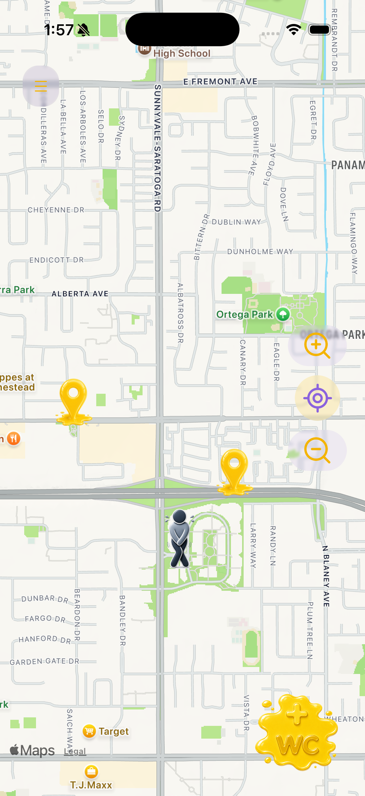

# 🚻 Jajisha

### Find a toilet. Add a toilet. Get there.

<p align="center">
  
</p>


<p align="center">
  <strong>A community-powered mobile application for discovering, reviewing, and navigating to public toilets.</strong>
</p>

<p align="center">
  <a href="https://github.com/devomid/jajisha">
    
  </a>
  
  
  
  
  
  
</p>

<p align="center">
  <a href="#overview">Overview</a> •
  <a href="#features">Features</a> •
  <a href="#engineering">Engineering</a> •
  <a href="#architecture">Architecture</a> •
  <a href="#testing">Testing</a> •
  <a href="#security">Security</a> •
  <a href="#setup">Setup</a>
</p>

---

## Overview

**Jajisha** is a full-stack, cross-platform mobile application designed around a simple problem:

> **Finding a public toilet should not be difficult.**

Jajisha lets users discover public toilets on an interactive map, inspect their information, contribute new locations, rate and review existing locations, save favorites, and navigate to selected toilets.

The application was built as an end-to-end product rather than a collection of isolated screens. It includes:

* Cross-platform mobile UI
* Geolocation and interactive maps
* User authentication
* User-generated content
* Ratings and reviews
* Favorites
* Navigation
* REST API communication
* MongoDB persistence
* Localization and Persian RTL text support
* Global asynchronous state handling
* Error handling and runtime diagnostics
* Automated frontend and backend testing
* API security controls

---

## Product

### The core experience

```text
        DISCOVER
           ↓
        SELECT
           ↓
        REVIEW
           ↓
       NAVIGATE
```

The goal is to make the complete process of finding a usable toilet as simple as possible.

---

## 📱 Screenshots

> Replace the placeholders below with carefully selected screenshots from the final application.
>
> **Recommended:** use clean screenshots from the same device size and avoid screenshots containing development/debug information.

### Main Map

<p align="center">
  
</p>

### Toilet Information

<p align="center">
  
</p>

### Navigation

<p align="center">
  
</p>

### Add a Toilet

<p align="center">
  
</p>

### Ratings & Reviews

<p align="center">
  
</p>

### Search

<p align="center">
  
</p>

### Settings

<p align="center">
  
</p>

### Persian / RTL Interface

<p align="center">
  
</p>

---

# ✨ Features

## 🗺️ Interactive Map

The map is the primary discovery interface.

Users can:

* View available public toilets
* Inspect toilet markers
* Select individual locations
* View toilet information
* Search for locations
* Use their current location
* Switch map presentation modes

---

## 📍 Location-Based Discovery

Jajisha uses device location services to help users find nearby toilets.

The application handles:

* Current location acquisition
* Distance calculations
* Location-dependent discovery
* Navigation targets
* Map positioning

---

## ➕ Community Contributions

Users can add public toilets to the map.

A contribution can include information used to help other users understand the location and its facilities.

The underlying architecture treats toilet locations as user-generated domain data rather than static application content.

---

## ⭐ Ratings

Toilets can be evaluated across multiple characteristics rather than relying only on a single overall score.

The rating system includes dimensions such as:

* Cleanliness
* Amenities
* Privacy
* Lighting
* Odor
* Crowd level

---

## 💬 Reviews

Authenticated users can submit reviews for toilet locations.

The review lifecycle includes:

```text
User input
    ↓
Validation
    ↓
API request
    ↓
Server validation
    ↓
Database persistence
    ↓
Updated application state
```

---

## 📷 Photos

Jajisha supports toilet-related images and photo galleries so users can get additional visual information about a location.

---

## ❤️ Favorites

Users can save useful toilet locations for easier access later.

---

## 🧭 Navigation

After selecting a toilet, users can start navigation toward it.

The navigation experience combines:

* Current location
* Destination coordinates
* Distance calculation
* Heading information
* Map camera control
* Navigation state management

---

## 🔎 Search

Users can search for locations beyond their immediate surroundings.

---

## 🌍 Localization

Jajisha currently supports:

| Language     | Status |
| ------------ | ------ |
| 🇬🇧 English | ✅     |
| 🇮🇷 Persian | ✅     |

The localization architecture is designed so additional languages can be introduced without restructuring the application.

Persian text also receives dedicated RTL text alignment while the overall application layout remains intentionally controlled rather than globally mirrored.

---

# 🧠 Engineering

Jajisha was built as a full-stack application with particular attention to application state, asynchronous operations, failure handling, security, and maintainability.

## Frontend

The mobile application is built with:

* React Native
* Expo
* Expo Router
* React Native Maps
* Expo Location
* React Native Paper
* Zustand
* Formik
* Yup
* i18next
* React Native Reanimated
* React Native Gesture Handler
* `@gorhom/bottom-sheet`
* React Native Skia
* Lucide React Native
* Expo Secure Store
* AsyncStorage

---

## Backend

The backend is built with:

* Node.js
* Express
* MongoDB
* Mongoose
* JWT
* bcryptjs
* Helmet
* CORS
* express-rate-limit
* Pino
* pino-http
* dotenv

---

# 🏗️ Architecture

Jajisha follows a client/server architecture.

```text
┌─────────────────────────────────────────────┐
│                  MOBILE APP                 │
│                                             │
│              React Native / Expo            │
│                                             │
│  ┌──────────┐  ┌────────────┐  ┌─────────┐ │
│  │   Map    │  │ Components │  │ Screens │ │
│  └────┬─────┘  └─────┬──────┘  └────┬────┘ │
│       │              │              │       │
│       └──────────────┼──────────────┘       │
│                      │                      │
│              ┌───────▼────────┐             │
│              │ Zustand Stores │             │
│              │     Hooks      │             │
│              │   API Layer    │             │
│              └───────┬────────┘             │
└──────────────────────┼──────────────────────┘
                       │
                       │ REST API
                       ▼
┌─────────────────────────────────────────────┐
│                 BACKEND API                 │
│                                             │
│                    Express                  │
│                      │                      │
│                ┌─────▼─────┐                │
│                │   Routes  │                │
│                └─────┬─────┘                │
│                      │                      │
│                ┌─────▼────────┐             │
│                │ Controllers  │             │
│                └─────┬────────┘             │
│                      │                      │
│                ┌─────▼─────┐                │
│                │  Models   │                │
│                └─────┬─────┘                │
└──────────────────────┼──────────────────────┘
                       │
                       ▼
                ┌──────────────┐
                │   MongoDB    │
                └──────────────┘
```

---

# 🔄 Application State

Global application state is managed with **Zustand**.

State is separated into focused stores for application concerns such as:

* User state
* Map/toilet data
* Settings
* Menu state
* Waiting state

This keeps transient UI state and application-level state separate from individual component state.

---

# ⚡ Asynchronous Lifecycle Handling

A major part of the frontend architecture is handling asynchronous operations consistently.

Jajisha contains centralized mechanisms for:

* Loading/waiting states
* Toast notifications
* API failures
* Request lifecycle handling
* Stale request protection
* Authentication restoration
* Error logging
* User-facing error feedback

This prevents individual screens from having to independently implement every loading and failure state.

---

# 🛡️ Defensive API Boundaries

Frontend API interactions validate response outcomes rather than assuming every request succeeds.

The application distinguishes between:

```text
Request started
      ↓
Response received
      ↓
HTTP success?
   ↙       ↘
 YES       NO
  ↓         ↓
Process   Handle error
data      + feedback
```

This is particularly important for user-generated operations such as:

* Creating toilets
* Saving toilets
* Creating reviews
* Authentication
* Loading reviews
* Location-dependent requests

---

# 🔐 Security

Security was treated as part of the application architecture rather than an afterthought.

The backend includes:

### Authentication

* JWT-based authentication
* Password hashing with bcryptjs
* Protected authenticated operations
* Authentication lifecycle handling

### HTTP security

* Helmet
* CORS configuration
* Rate limiting

### Input validation

* Request validation
* Domain validation
* Rating validation
* Review validation
* Defensive handling of malformed input

### Secrets

Sensitive configuration is supplied through environment variables.

No database credentials or authentication secrets should be committed to the repository.

---

# 🧪 Testing

Testing covers the frontend, backend, and security surface.

## Frontend

The frontend test suite covers:

* Zustand stores
* Utility functions
* Hooks
* Authentication logic
* Navigation logic
* Review logic
* Location logic
* Theme behavior
* API/theme boundaries
* Validation

## Backend

The backend suite covers:

* Controllers
* Routes
* Authentication
* Validation
* Database interactions
* API behavior

## Security

Dedicated security tests cover areas including:

* Authentication
* JWT behavior
* Authorization
* Injection handling
* Validation
* Rate limiting
* Security headers
* Data exposure

### Current automated test status

```text
Frontend
115 / 115 tests passing

Backend
103 / 103 tests passing

Security
32 / 32 tests passing
```

**Total automated tests: 250**

---

# 📊 Test Structure

The repository keeps frontend and backend testing separated from application source code.

```text
jajisha/
│
├── frontend/
│   ├── src/
│   ├── tests/
│   │   ├── utils/
│   │   ├── store/
│   │   ├── hooks/
│   │   └── ...
│   └── jest.config.js
│
├── backend/
│   ├── controllers/
│   ├── models/
│   ├── routes/
│   └── test/
│
└── secTests/
    ├── auth/
    ├── authorization/
    ├── injection/
    ├── validation/
    ├── rateLimit/
    ├── headers/
    └── dataExposure/
```

---

# 📁 Project Structure

```text
jajisha/
│
├── backend/
│   ├── controllers/
│   ├── middlewares/
│   ├── models/
│   ├── routes/
│   ├── test/
│   ├── .env.example
│   ├── server.js
│   └── package.json
│
├── frontend/
│   ├── app/
│   ├── components/
│   ├── src/
│   │   ├── api/
│   │   ├── constants/
│   │   ├── hooks/
│   │   ├── i18n/
│   │   ├── locales/
│   │   └── validation/
│   ├── store/
│   ├── tests/
│   ├── assets/
│   ├── android/
│   ├── ios/
│   ├── app.json
│   ├── jest.config.js
│   └── package.json
│
├── secTests/
│   ├── auth/
│   ├── authorization/
│   ├── injection/
│   ├── validation/
│   ├── rateLimit/
│   ├── headers/
│   ├── dataExposure/
│   ├── setup.js
│   └── package.json
│
├── LICENSE
└── README.md
```

---

# 🚀 Running Jajisha Locally

## Requirements

You will need:

* Node.js
* npm
* Git
* MongoDB
* Expo development environment
* Xcode for iOS development
* Android Studio for Android development

---

## 1. Clone

```bash
git clone https://github.com/devomid/jajisha.git
cd jajisha
```

---

## 2. Backend

```bash
cd backend
npm install
```

Create:

```text
backend/.env
```

using the structure from:

```text
backend/.env.example
```

Example:

```env
MONGOURI=your_mongodb_connection_string
PORT=your_port_number
SECRET_KEY=your_jwt_secret
CLIENT_ORIGIN=http://localhost:8081
```

Start the backend:

```bash
npm run dev
```

or:

```bash
npm start
```

---

## 3. Frontend

Open another terminal:

```bash
cd frontend
npm install
```

Start Expo:

```bash
npm start
```

For native development:

```bash
npm run ios
```

or:

```bash
npm run android
```

---

# 🧪 Running Tests

## Frontend

```bash
cd frontend
npm test
```

## Backend

```bash
cd backend
npm test
```

## Security

```bash
cd secTests
npm test
```

---

# 📱 Platform Support

| Platform | Status                        |
| -------- | ----------------------------- |
| iOS      | ✅                            |
| Android  | ✅                            |
| Web      | ⚠️ Development/experimental |

The primary product targets are **iOS and Android**.

---

# 🌍 Localization

| Language | Status |
| -------- | ------ |
| English  | ✅     |
| Persian  | ✅     |

The localization layer uses:

* i18next
* react-i18next
* dedicated locale files
* Persian text alignment
* RTL-aware text presentation

---

# 🎨 UI & Design

Jajisha uses a custom mobile interface built around:

* React Native Paper
* Custom theming
* Light and dark modes
* Persian typography
* Shabnam font
* Bottom-sheet based interactions
* Blur and glass-style visual elements
* Animated transitions
* Map-focused interaction patterns

The UI was designed specifically for mobile use rather than treating the application as a web interface inside a mobile shell.

---

# 📸 Product Showcase

> This section is intentionally separate from the feature documentation.
> Use your strongest final screenshots here.

### Discovery

<p align="center">
  
  
  
</p>

### Contribution

<p align="center">
  
  
  
</p>

### Localization & Settings

<p align="center">
  
  
  
</p>

---

# 🎥 Demo

> Add a short 30–60 second product demonstration here once the final recording is ready.

**Recommended demo sequence:**

```text
Open app
```


