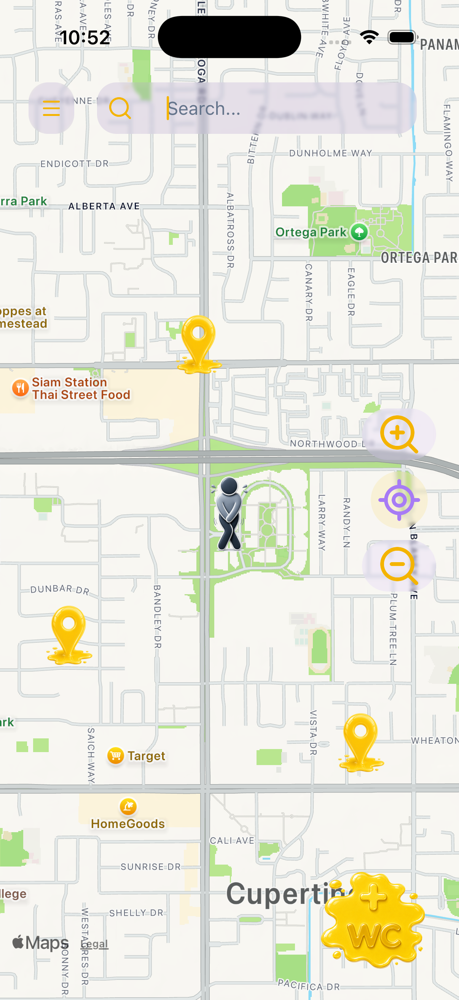
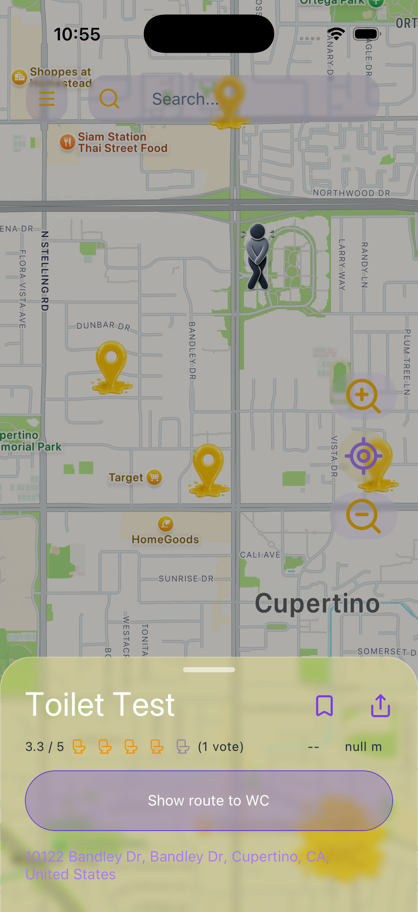
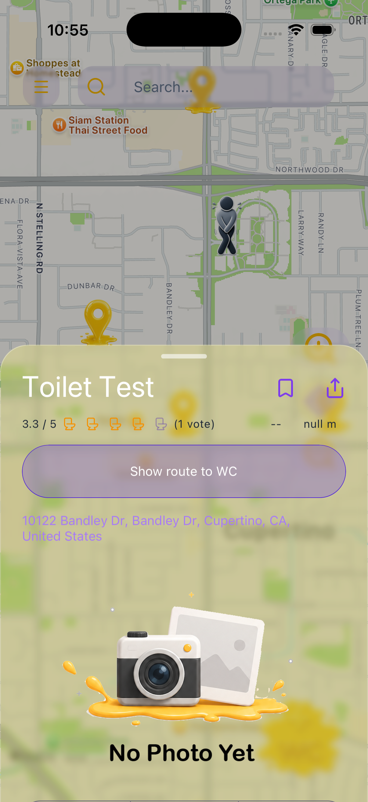
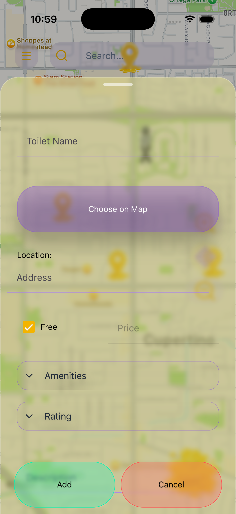
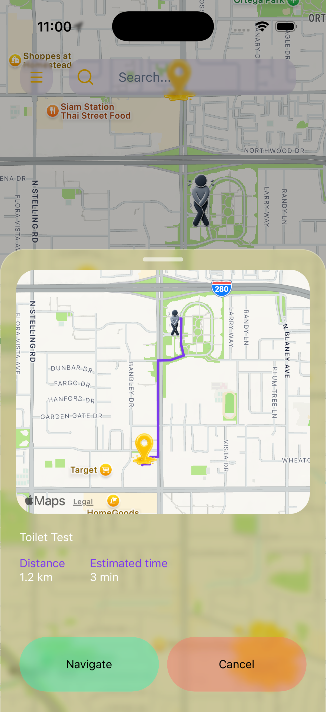
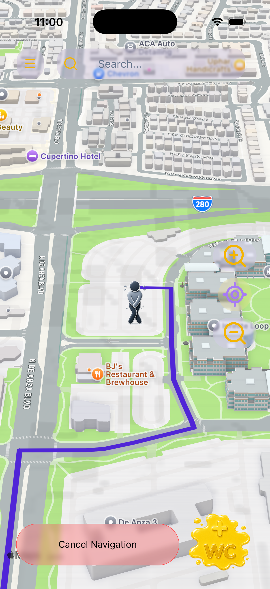

# 🚻 Jajisha

### Find a toilet. Add a toilet. Get there.



**Jajisha** is a free, user-driven mobile application for discovering, adding, reviewing, and navigating to public toilets.

The idea behind Jajisha came from a simple problem: **public toilets are often surprisingly difficult to find**. When you're in a city or an unfamiliar area, you may have no idea where the nearest toilet is — and even if you find one, you often don't know whether it is clean, usable, accessible, or properly equipped.

Jajisha aims to turn that missing information into a **community-powered map of public toilets**.

> **If you know where a toilet is, someone else shouldn't have to search for it.**

---

## 📱 Overview

Jajisha combines an interactive map, location services, user-generated toilet locations, ratings, reviews, and navigation into a single mobile experience.

Users can:

* 🗺️ Discover public toilets around them
* 📍 See toilet locations directly on a map
* ➕ Add new toilets to the database
* ⭐ Rate toilets
* 💬 Leave reviews
* 📷 Add information and photos
* ❤️ Save favorite locations
* 🧭 Navigate to a selected toilet
* 🔎 Search for locations
* 🌍 Use the application in English or Persian

The long-term goal is to build a reliable, community-maintained source of information about public toilets — city by city and eventually worldwide.

---

## ✨ Why Jajisha?

Finding a restaurant, coffee shop, hotel, pharmacy, or gas station is easy.

Finding a toilet isn't.

Public toilets exist everywhere, but information about them is often fragmented, outdated, incomplete, or simply unavailable.

Jajisha approaches the problem from a different direction:

**Let the people who discover these places build the database.**

Instead of relying entirely on a centralized source of information, Jajisha allows users to contribute locations and information themselves. Over time, this can create a continuously growing map of public toilets based on real-world usage and community knowledge.

---

## 🏷️ Where does the name come from?

**Jajisha (جاجیشا)** is a coined Persian name.

It combines:

* **Ja (جا)** — *place*
* **Jish (جیش)** — *pee*

The name is intentionally simple, playful, and directly connected to the purpose of the application.

---

## 🚀 Features

### 🗺️ Interactive Map

The primary interface of Jajisha is a map-based experience where users can discover nearby toilet locations.

Toilet markers provide a quick visual overview of available locations, while selecting a marker opens more detailed information.

<!-- SCREENSHOT: Add your main map screenshot here -->

<!-- Suggested file: docs/screenshots/map.png -->

---

### 📍 Find Nearby Toilets

Jajisha uses the device's location to help users discover toilets around their current position.

The experience is designed around a simple question:

> **"Where can I find a toilet right now?"**



---

### ➕ Add a Toilet

Jajisha is user-powered.

Anyone can contribute by adding a toilet location to the map, helping expand the database for other users.



<!-- SCREENSHOT: Add your "Add Toilet" screen here -->

<!-- Suggested file: docs/screenshots/add-toilet.png -->

---

### ⭐ Ratings & Reviews

Users can share their experience with a toilet through ratings and reviews.

This is particularly important because knowing that a toilet exists is only part of the problem.

Users also want to know:

* Is it clean?
* Is it usable?
* Is it well equipped?
* Is it worth going to?

Community feedback can make this information significantly more useful.

<!-- SCREENSHOT: Add your toilet details/reviews screen here -->

<!-- Suggested file: docs/screenshots/reviews.png -->

---

### 📷 Photos

Visual information can help users understand what to expect before visiting a location.

Jajisha includes support for toilet-related images and photo galleries.

<!-- SCREENSHOT: Add your photo gallery screen here -->

<!-- Suggested file: docs/screenshots/gallery.png -->

---

### ❤️ Favorites

Users can save useful toilet locations for easier access later.

<!-- SCREENSHOT: Add your favorites screen here -->

<!-- Suggested file: docs/screenshots/favorites.png -->

---

### 🧭 Navigation

Once a user selects a toilet, Jajisha can help them get there using navigation.

The goal is to reduce the entire process to:

**Find → Select → Navigate**



---

### 🔎 Search

Users can search for locations and discover toilets beyond their immediate surroundings.

<!-- SCREENSHOT: Add your search UI here -->

<!-- Suggested file: docs/screenshots/search.png -->

---

### 🌍 Localization

Jajisha currently supports:

* 🇬🇧 English
* 🇮🇷 Persian

Internationalization is built into the application architecture so additional languages can be introduced later.

---

# 🏗️ Architecture

Jajisha is structured as a full-stack application with a React Native frontend communicating with a Node.js/Express backend.

```text
┌──────────────────────────────────────────┐
│              JAJISHA APP                 │
│                                          │
│          React Native / Expo             │
│                                          │
│  ┌────────────┐    ┌─────────────────┐  │
│  │    Map     │    │  User Interface │  │
│  └────────────┘    └─────────────────┘  │
│          │                 │             │
│  ┌────────────┐    ┌─────────────────┐  │
│  │ Location   │    │ Zustand Stores  │  │
│  └────────────┘    └─────────────────┘  │
│                                          │
└──────────────────┬───────────────────────┘
                   │
                   │ REST API
                   ▼
┌──────────────────────────────────────────┐
│              BACKEND API                 │
│                                          │
│              Node.js                     │
│              Express                     │
│                                          │
│  ┌──────────────┐   ┌────────────────┐  │
│  │    Routes    │ → │  Controllers   │  │
│  └──────────────┘   └────────────────┘  │
│                              │           │
│                       ┌──────▼──────┐    │
│                       │   Models    │    │
│                       └──────┬──────┘    │
└──────────────────────────────┼───────────┘
                               │
                               ▼
                     ┌──────────────────┐
                     │     MongoDB      │
                     │                  │
                     │ Users            │
                     │ Toilets          │
                     │ Reviews          │
                     │ Ratings          │
                     └──────────────────┘
```

---

# 🧰 Tech Stack

## Frontend

| Technology                             | Purpose                           |
| -------------------------------------- | --------------------------------- |
| **React Native**                 | Cross-platform mobile application |
| **Expo**                         | React Native development platform |
| **Expo Router**                  | File-based application routing    |
| **React Native Maps**            | Interactive maps                  |
| **Expo Location**                | Device location services          |
| **React Native Paper**           | UI components                     |
| **Zustand**                      | Application state management      |
| **React Hook Form**              | Form management                   |
| **Formik**                       | Form handling                     |
| **Yup**                          | Validation                        |
| **i18next**                      | Internationalization              |
| **React Native Reanimated**      | Animations                        |
| **React Native Gesture Handler** | Gesture interactions              |
| **@gorhom/bottom-sheet**         | Bottom sheet interfaces           |
| **React Native Skia**            | Graphics and custom rendering     |
| **Lucide React Native**          | Icons                             |

## Backend

| Technology         | Purpose                       |
| ------------------ | ----------------------------- |
| **Node.js**  | Backend runtime               |
| **Express**  | REST API framework            |
| **MongoDB**  | Database                      |
| **Mongoose** | MongoDB object modeling       |
| **JWT**      | Authentication                |
| **Passport** | Authentication middleware     |
| **bcrypt**   | Password hashing              |
| **Helmet**   | HTTP security                 |
| **CORS**     | Cross-origin resource sharing |
| **dotenv**   | Environment configuration     |
| **Nodemon**  | Development server            |

---

# 📂 Project Structure

The repository is divided into two primary applications:

```text
jajisha/
│
├── backend/
│   ├── controllers/
│   │   ├── toiletController.js
│   │   └── userController.js
│   │
│   ├── models/
│   │   ├── ratingModel.js
│   │   ├── reviewModel.js
│   │   ├── toiletModel.js
│   │   └── userModel.js
│   │
│   ├── routes/
│   │   ├── toiletRoutes.js
│   │   └── userRoutes.js
│   │
│   ├── server.js
│   └── package.json
│
└── frontend/
    │
    ├── app/
    │   ├── (auth)/
    │   ├── index.js
    │   ├── Account.js
    │   ├── Favorites.js
    │   ├── Settings.js
    │   └── About.js
    │
    ├── components/
    │   ├── blur/
    │   ├── bottomSheet/
    │   ├── map/
    │   ├── menuDrawer/
    │   ├── newToilet/
    │   ├── photoGallery/
    │   ├── reviews/
    │   ├── searchBar/
    │   └── topNav/
    │
    ├── src/
    │   ├── api/
    │   ├── constants/
    │   ├── hooks/
    │   ├── i18n/
    │   ├── locales/
    │   └── validation/
    │
    ├── store/
    │   ├── drawerStore.js
    │   ├── userStore.js
    │   └── wcDataStore.js
    │
    ├── assets/
    ├── android/
    ├── ios/
    ├── app.json
    └── package.json
```

### Frontend architecture

The frontend is organized around several major concerns:

* **`app/`** — application routes and screens
* **`components/`** — reusable UI components
* **`src/api/`** — API communication
* **`src/hooks/`** — reusable application logic
* **`src/i18n/`** — localization configuration
* **`src/locales/`** — translated strings
* **`src/validation/`** — form validation
* **`store/`** — global application state

### Backend architecture

The backend follows a conventional REST architecture:

```text
Request
   │
   ▼
Routes
   │
   ▼
Controllers
   │
   ▼
Mongoose Models
   │
   ▼
MongoDB
```

This separation keeps API routing, business logic, and database models independent and easier to maintain.

---

# 🔐 Authentication & Security

Jajisha includes user authentication and account functionality.

The backend uses:

* JSON Web Tokens
* Passport
* bcrypt password hashing
* Environment-based secrets
* Helmet security middleware
* CORS configuration

Sensitive configuration such as database credentials and authentication secrets is stored in environment variables rather than committed to the repository.

> **Never commit your `.env` file or production secrets to Git.**

---

# 🗄️ Data Model

The backend currently separates the primary domain entities into dedicated models:

```text
User
 │
 ├── Reviews
 ├── Ratings
 └── Favorites

Toilet
 │
 ├── Location
 ├── Reviews
 ├── Ratings
 └── Images
```

The API exposes separate routes for users and toilets, allowing the frontend to interact with the backend through a clean REST interface.

---

# 🌐 API

The backend provides REST endpoints for the application's core resources.

Current API areas include:

```text
/api/users
/api/toilets
```

The exact endpoints and request/response contracts are intentionally kept in the backend route and controller layers.

As the API stabilizes, dedicated API documentation can be added here.

---

# 🚀 Getting Started

## Prerequisites

Before running Jajisha locally, make sure you have:

* Node.js
* npm
* Git
* Expo development environment
* Xcode for iOS development
* Android Studio for Android development
* A MongoDB database

For iOS development, a macOS environment with Xcode is required.

---

## 1. Clone the repository

```bash
git clone https://github.com/devomid/jajisha.git
cd jajisha
```

---

## 2. Install frontend dependencies

```bash
cd frontend
npm install
```

---

## 3. Configure the frontend

Create the required environment/configuration values for your local development environment.

> Do not commit API keys, database credentials, JWT secrets, or other private values to GitHub.

---

## 4. Start Expo

```bash
npm start
```

This starts the Expo development server.

You can then run the application using your preferred development target.

### iOS

```bash
npm run ios
```

### Android

```bash
npm run android
```

### Web

```bash
npm run web
```

> Web support is currently experimental/planned. The primary targets are iOS and Android.

---

# 🖥️ Running the Backend

Open a second terminal:

```bash
cd backend
npm install
```

Create a `.env` file containing your backend configuration.

For example:

```env
MONGO_URI=your_mongodb_connection_string
JWT_SECRET=your_secret
```

Use your actual environment variable names if they differ from the example above.

Then start the development server:

```bash
npm run dev
```

For a normal start:

```bash
npm start
```

---

# ⚙️ Environment Variables

The backend requires sensitive configuration to be supplied through environment variables.

Typical configuration includes:

```env
MONGO_URI=
JWT_SECRET=
```

Your actual `.env` file should **never** be committed to the repository.

A safe approach is to provide an example file:

```text
.env.example
```

containing:

```env
MONGO_URI=
JWT_SECRET=
```

This allows other developers to understand which variables are required without exposing credentials.

---

# 📱 Platform Support

### Current

* ✅ iOS
* ✅ Android

### Planned

* 🔄 Progressive Web App (PWA)
* 🔄 Wider public distribution
* 🔄 App Store release
* 🔄 Google Play release

The application is built with cross-platform development in mind, with iOS and Android as the primary mobile targets.

---

# 🌍 Localization

Jajisha currently supports:

| Language     | Status |
| ------------ | ------ |
| 🇬🇧 English | ✅     |
| 🇮🇷 Persian | ✅     |

Localization is implemented using **i18next** and **react-i18next**, allowing additional languages to be added without restructuring the application.

---

# 🛣️ Roadmap

Jajisha is an actively developed project.

The long-term direction includes:

* [X] Interactive toilet map
* [X] User toilet submissions
* [X] User accounts
* [X] Ratings
* [X] Reviews
* [X] Favorites
* [X] Location services
* [X] Navigation
* [X] English localization
* [X] Persian localization
* [X] Public release
* [ ] App Store distribution
* [ ] Google Play distribution
* [ ] PWA
* [ ] Expand the toilet database
* [ ] Improve moderation and data quality
* [ ] Continue improving toilet information and accessibility data

The roadmap will evolve as the application moves from development toward public use.

---

# 🤝 Contributing

Jajisha is currently primarily developed as an independent project, but contributions and ideas can become increasingly valuable as the application grows.

If you find a bug, have an idea, or want to suggest an improvement:

1. Open an issue.
2. Describe the problem or proposed improvement.
3. Include relevant screenshots or reproduction steps when possible.
4. For code contributions, create a branch and submit a pull request.

Constructive feedback is welcome.

---

# 🐛 Reporting Issues

If you encounter a bug, please include:

* Device/platform
* OS version
* Steps to reproduce
* Expected behavior
* Actual behavior
* Screenshots or logs when applicable

This makes debugging significantly easier.

---

# 📄 License

Jajisha currently does not have an open-source license.

Until a license is added, the repository should **not be assumed to grant permission to copy, modify, redistribute, or commercially use the source code**.

A license will be selected before the project is formally presented as an open-source project.

---

# 👨‍💻 About the Project

Jajisha is an independent project created by **Omid**.

The project was built to explore the complete lifecycle of a real-world mobile product — from product idea and UI/UX design to mobile development, geolocation, mapping, authentication, backend APIs, database design, user-generated content, localization, and deployment.

It is also intended as a portfolio project demonstrating full-stack application development across mobile and backend technologies.

---

# 🔗 Links

**Repository**

[github.com/devomid/jajisha](https://github.com/devomid/jajisha?utm_source=chatgpt.com)

---

## ⭐ Support the Project

If you find the idea interesting, consider giving the repository a ⭐ on GitHub.

It helps the project get noticed and provides motivation to keep building it.

---

<div align="center">
