<div align="center">

# Jajisha

### Find. Explore. Navigate. Share.

A location-based mobile application for discovering, evaluating, saving, and navigating to public toilets.

Built with React Native and Expo on the frontend, and Node.js, Express, and MongoDB on the backend.

<br />


<br /><br />

[](https://reactnative.dev/)
[](https://expo.dev/)
[](https://docs.expo.dev/router/)
[](https://react.dev/)
[](https://developer.mozilla.org/en-US/docs/Web/JavaScript)
[](https://nodejs.org/)
[](https://expressjs.com/)
[](https://www.mongodb.com/)
[](https://mongoosejs.com/)
[](https://zustand.docs.pmnd.rs/)
[](https://reactnativepaper.com/)
[](https://github.com/react-native-maps/react-native-maps)
[](https://docs.swmansion.com/react-native-reanimated/)
[](https://docs.swmansion.com/react-native-gesture-handler/)
[](https://gorhom.dev/react-native-bottom-sheet/)
[](https://www.i18next.com/)
[](https://docs.expo.dev/versions/latest/sdk/securestore/)
[](https://docs.expo.dev/versions/latest/sdk/location/)
[](https://jwt.io/)
[](https://www.npmjs.com/package/bcryptjs)
[](https://helmetjs.github.io/)
[](https://www.npmjs.com/package/express-rate-limit)
[](https://getpino.io/)
[](https://jestjs.io/)
[](https://github.com/ladjs/supertest)
[](https://formik.org/)
[](https://github.com/jquense/yup)
[](https://lucide.dev/)
[](LICENSE)

</div>

---

## Overview

Jajisha is a full-stack mobile application built around a simple problem:

> **When you need a public toilet, finding one should be straightforward.**

The application combines geospatial discovery, interactive maps, toilet information, ratings and reviews, favorites, route planning, navigation, localization, authentication, and personalized settings into one mobile experience.

The project was developed as a complete product rather than a collection of isolated screens. The frontend, backend, API layer, database models, authentication, validation, security controls, state management, logging, and automated tests are all part of the same system.

---

## The Product

Jajisha is centered around a simple flow:

**Discover → Inspect → Review → Route → Navigate**

Users can:

* Discover nearby public toilets
* Explore toilet locations on an interactive map
* View detailed toilet information
* See ratings and community reviews
* Rate and review toilets
* Save toilets for later
* Preview routes
* Navigate to a selected toilet
* Add new toilets to the map
* Select an exact toilet location
* Provide pricing and amenity information
* Switch map types
* Choose metric or imperial distance units
* Use light, dark, or system appearance
* Use English or Persian
* Use a right-to-left Persian interface
* Create and manage an account
* Receive consistent loading and feedback states

---

# Product Experience

## Discovering Toilets

The main experience starts with the map.

Nearby toilets can be explored directly from the map while maintaining the surrounding geographic context. The interface is designed around location rather than requiring users to navigate through a conventional list-first workflow.

<div align="center">


</div>

The map and surrounding interface work together to keep discovery quick while still providing access to the application's other areas.

---

## Map Experience

Maps are a core part of Jajisha rather than simply a background for location markers.

Users can interact with the map, inspect toilet locations, view their own position, and customize how geographic information is presented.

The application supports different map presentation options, including a satellite view.

<div align="center">

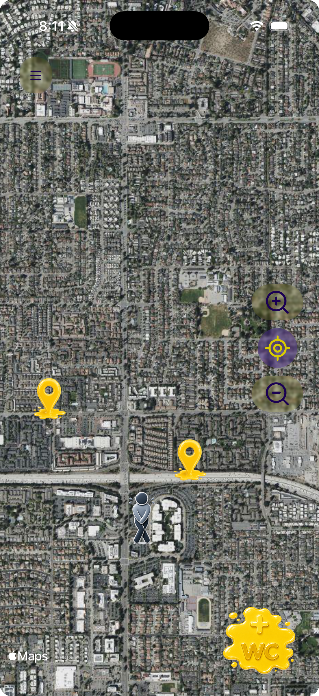
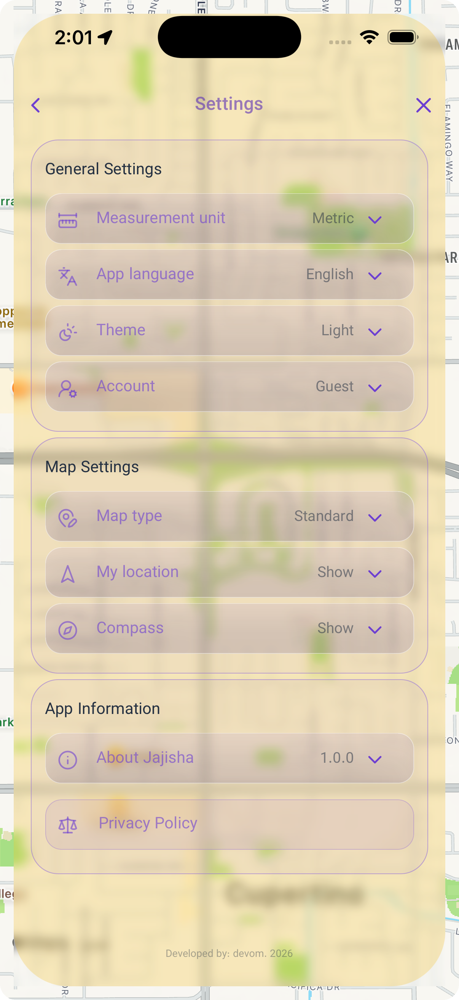

</div>

### Map and distance preferences

Map-related preferences are exposed through the settings system.

Users can change:

* Map type
* Distance unit
* Appearance
* Other application preferences

Distance measurements can be displayed using **metric or imperial units**, allowing the same interface to adapt to different user preferences.

---

# Toilet Information

Selecting a toilet opens a dedicated information experience.

Jajisha uses a bottom-sheet based interface so users can progressively inspect a location without immediately leaving the map.

<div align="center">


</div>

The information interface can expose details such as:

* Toilet name and location
* Rating
* Reviews
* Pricing
* Amenities
* Photos
* Navigation actions

The sheet can be expanded as more information is needed while keeping the selected location connected to the map underneath.

A dark-mode version of the same experience is also supported.

<div align="center">

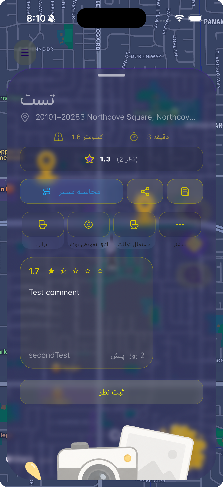

</div>

---

# Ratings & Reviews

Community-generated information adds context that a map marker alone cannot provide.

Authenticated users can rate toilets and leave written reviews.

<div align="center">


</div>

Reviews are associated with users and toilets through the backend API, with authorization rules protecting user-specific operations.

This turns Jajisha from a static location directory into a user-contributed information system.

---

# Route Planning & Navigation

Finding a toilet is only part of the experience.

Once a user selects a location, Jajisha can transition from discovery into route planning and active navigation.

<div align="center">

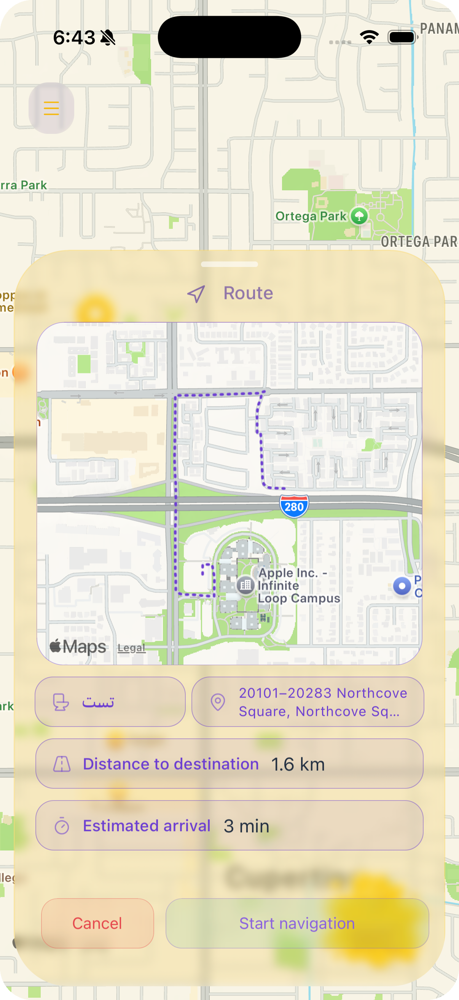
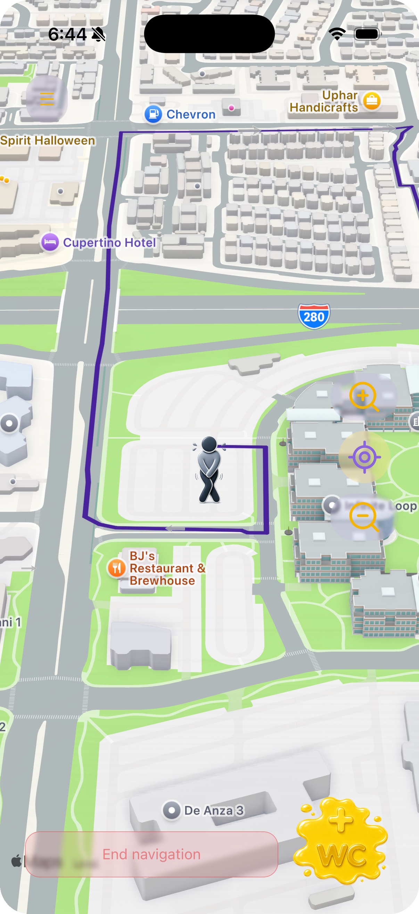

</div>

The navigation flow separates:

**Location → Route Preview → Active Navigation**

This gives users an opportunity to inspect the route before beginning navigation.

Navigation also integrates with the application's location, map, and distance-unit settings.

---

# Adding a Toilet

Jajisha is designed to allow the community to contribute new locations.

Users can add a toilet and specify its geographic position and relevant information.

<div align="center">

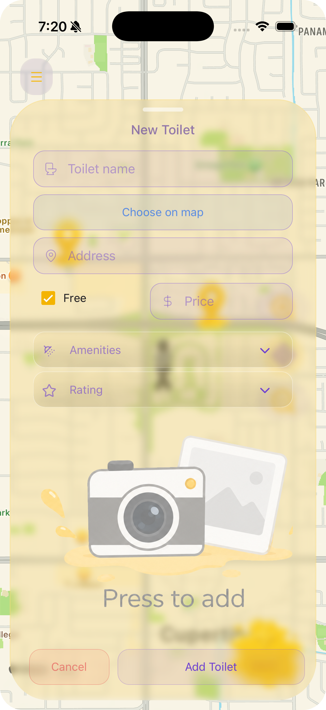
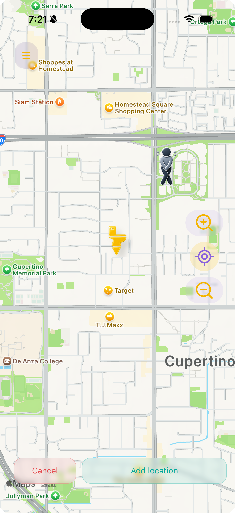

</div>

The workflow allows users to:

* Add a toilet
* Select its exact location
* Provide descriptive information
* Specify whether it is free or paid
* Add available amenities
* Submit the information through the API

Location data is stored using geospatial database structures so that toilets can later be queried according to geographic position.

---

# Saved Toilets

Users can save toilets that they may want to access again.

<div align="center">


</div>

Saved locations are associated with the authenticated user, creating a personal layer on top of the public toilet database.

---

# Personalization

## Light, Dark & System Appearance

Jajisha supports three appearance modes:

* **Light**
* **Dark**
* **System**

The system option follows the device's current appearance preference.

<div align="center">


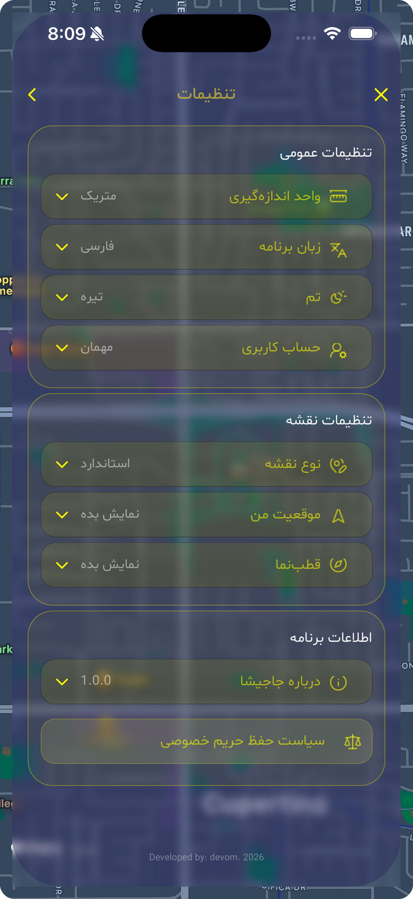

</div>

Theme handling is integrated throughout the application rather than implemented as isolated styling on individual screens.

The result is a consistent visual system across maps, sheets, forms, navigation, settings, and feedback states.

---

## Application Settings

Settings provide a central place for controlling the experience.

Depending on the selected configuration, users can control:

* Appearance
* Map presentation
* Distance units
* Other application preferences

The settings architecture allows these choices to persist as application-level preferences rather than requiring users to configure them repeatedly.

---

# Localization & RTL

Jajisha supports both **English and Persian**.

Persian support goes beyond translating strings. The interface also accounts for the layout requirements of a right-to-left language.

<div align="center">

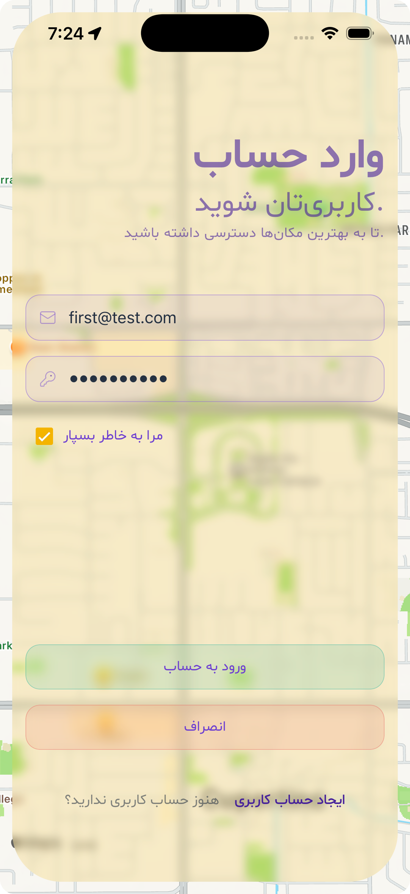
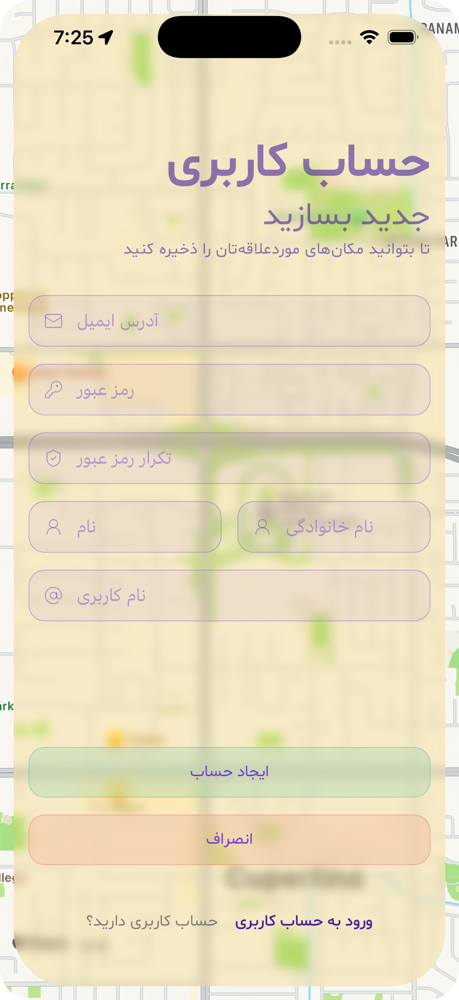

</div>

The Persian interface includes right-to-left layouts across relevant screens, including forms, navigation, settings, and information interfaces.

<div align="center">

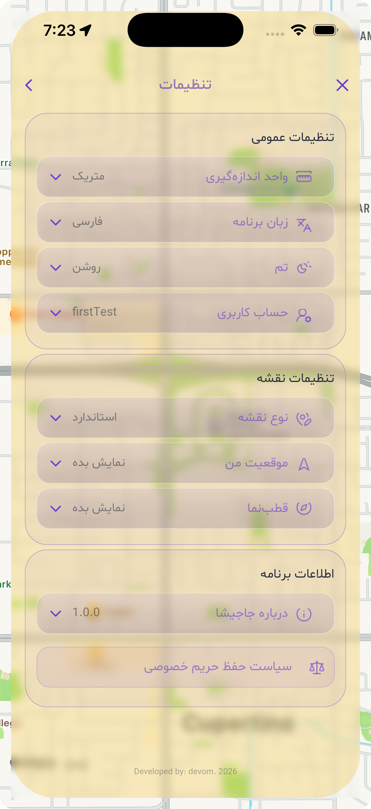
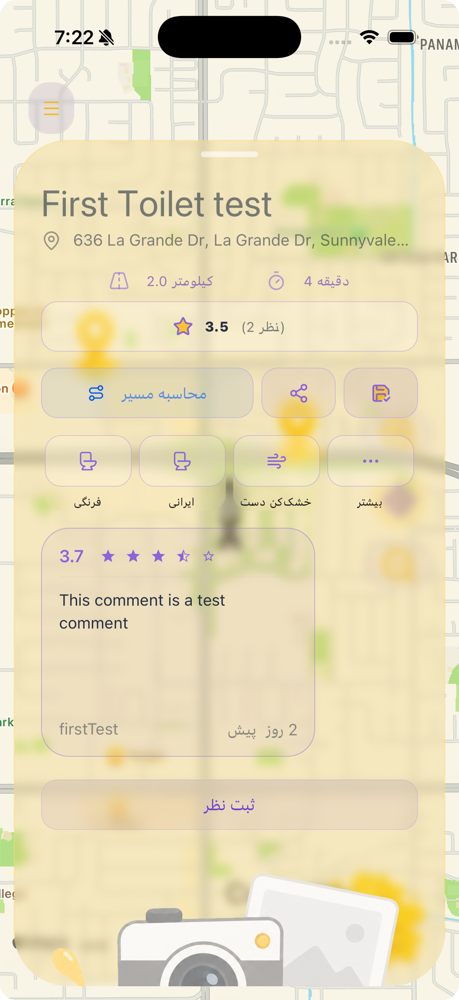

</div>

Localization is implemented with `i18next` and `react-i18next`, while application state controls the active language.

---

# Authentication

Jajisha includes its own authentication system rather than treating identity as an external application concern.

Users can create accounts and sign in to access functionality that requires an authenticated identity.

<div align="center">


</div>

The backend includes:

* Password hashing
* JWT-based authentication
* Authentication middleware
* Authorization checks
* Protected resources
* Request validation
* Rate limiting
* Security headers

Authentication state is persisted on the client using secure device storage.

---

# Interaction Design

Jajisha relies heavily on mobile-native interaction patterns.

### Bottom sheets

Toilet information and contextual actions use bottom sheets so users can interact with additional information while maintaining map context.

### Layered navigation

The primary product flow is intentionally divided into distinct stages:

**Discovery → Information → Route Preview → Navigation**

Each stage has a clear purpose instead of placing every action into a single screen.

### Asynchronous feedback

Network and asynchronous operations use centralized feedback systems.

<div align="center">

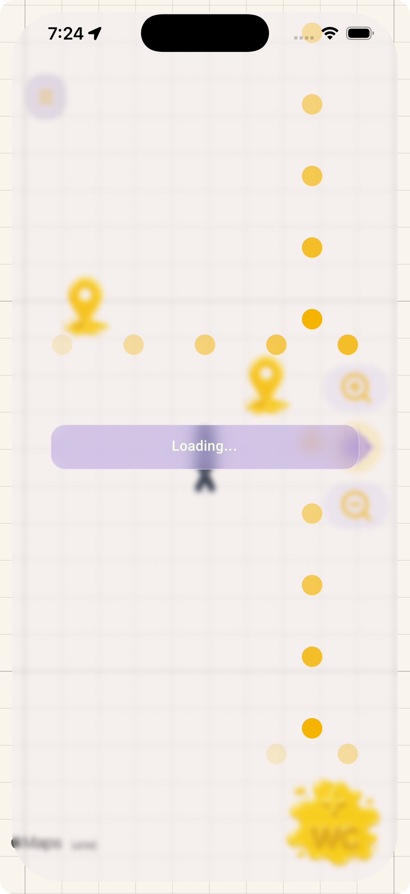

</div>

Jajisha uses centralized waiting and toast systems so loading and action feedback remain consistent throughout the application.

---

# Architecture

Jajisha is organized as a full-stack application with clear frontend and backend responsibilities.

```text
jajisha/
├── backend/
│   ├── controllers/
│   ├── logger/
│   ├── middlewares/
│   ├── models/
│   ├── routes/
│   ├── secTests/
│   ├── test/
│   ├── app.js
│   └── server.js
│
├── frontend/
│   ├── app/
│   ├── components/
│   ├── hooks/
│   ├── stores/
│   ├── utils/
│   └── ...
│
├── docs/
│   └── readme/
│
└── README.md
```

The frontend communicates with the backend through a REST API.

The backend is responsible for:

* Authentication
* Authorization
* Validation
* Toilet management
* Reviews
* User-related operations
* Geospatial queries
* Security controls
* Database access

The frontend is responsible for:

* Navigation
* Map interaction
* UI state
* User interaction
* Localization
* Theme management
* Device-side persistence
* API integration

---

# Frontend Architecture

The mobile application is built with React Native and Expo.

Expo Router provides the navigation structure, while reusable components, hooks, stores, and utilities separate UI concerns from application logic.

The frontend includes dedicated systems for:

* Authentication
* Theme management
* Localization
* Toast notifications
* Waiting/loading states
* Map state
* User state
* Settings
* Saved toilets
* Toilet data

---

# State Management

Jajisha uses **Zustand** for application state.

Different stores handle different concerns rather than placing the entire application into a single global state object.

Examples include state for:

* Toilet and map data
* User information
* Menu state
* Settings
* Waiting states

This keeps global state focused and makes individual application concerns easier to reason about.

---

# Backend Architecture

The backend is built with:

* Node.js
* Express
* MongoDB
* Mongoose

The backend separates routes, controllers, models, middleware, logging, and application/server initialization.

```text
Request
   ↓
Express
   ↓
Middleware
   ↓
Authentication / Validation
   ↓
Route
   ↓
Controller
   ↓
Mongoose Model
   ↓
MongoDB
```

This structure keeps HTTP concerns separate from database operations and makes the API easier to test and maintain.

---

# Geospatial Data

Location is fundamental to Jajisha, so geographic data is treated as a first-class part of the backend.

Toilet locations use GeoJSON-compatible coordinates and MongoDB geospatial indexing.

This allows geographic queries to be performed by the database instead of retrieving the entire toilet collection and calculating distances on the client.

The architecture supports functionality such as:

* Nearby toilet discovery
* Distance-based queries
* Geographic filtering
* Location-aware search

---

# Security

Security is part of the application's architecture rather than an afterthought.

The backend includes protections covering:

* JWT authentication
* Authorization
* Password hashing
* Request validation
* Rate limiting
* HTTP security headers
* Input handling
* Injection-related cases
* Protected resource access
* Data exposure

The repository also contains dedicated security tests covering authentication, authorization, JWT behavior, headers, validation, injection, rate limiting, and data exposure.

---

# Testing

Jajisha contains automated tests across both the backend and frontend.

## Backend

Backend tests use:

* Jest
* Supertest

The test suite covers areas including:

* Authentication
* Authorization
* API behavior
* Validation
* Security
* Rate limiting
* Data access

## Frontend

Frontend tests cover application-level behavior including:

* API utilities
* Hooks
* Stores
* Themes
* Validation
* Utility functions

Testing is part of the development workflow rather than relying exclusively on manual testing.

---

# Logging & Diagnostics

The backend uses structured logging with Pino and HTTP request logging.

The logging system provides visibility into:

* Server startup
* MongoDB connection state
* HTTP requests
* Request identifiers
* Errors
* Application events

The frontend also has a dedicated logging layer for development diagnostics, keeping debugging output more structured than scattered `console.log` statements.

---

# Technology Stack

## Mobile

* React Native
* Expo
* Expo Router
* React Native Paper
* React Native Maps
* React Native Reanimated
* React Native Gesture Handler
* `@gorhom/bottom-sheet`
* Zustand
* i18next
* Expo SecureStore
* Expo Location
* Lucide React Native

## Backend

* Node.js
* Express
* MongoDB
* Mongoose
* JWT
* bcryptjs
* Helmet
* express-rate-limit
* Pino
* Pino HTTP

## Testing

* Jest
* Supertest
* Frontend unit tests
* Backend API tests
* Security-focused tests

---

# Local Development

Clone the repository:

```bash
git clone https://github.com/devomid/jajisha.git
cd jajisha
```

Install backend dependencies:

```bash
cd backend
npm install
```

Install frontend dependencies:

```bash
cd ../frontend
npm install
```

Run the backend:

```bash
cd backend
npm run dev
```

Run the frontend:

```bash
cd frontend
npm start
```

The mobile application can then be opened through the Expo development workflow.

---

# Environment Configuration

The backend uses environment variables for deployment-specific configuration.

Typical variables include:

```env
MONGOURI=your_mongodb_connection_string
PORT=3001
CLIENT_ORIGIN=http://localhost:8081
SECRET_KEY=your_secret_key
```

Secrets and environment-specific credentials should never be committed to the repository.

---

# Project Structure

```text
jajisha/
│
├── backend/
│   ├── controllers/
│   ├── logger/
│   ├── middlewares/
│   ├── models/
│   ├── routes/
│   ├── secTests/
│   ├── test/
│   ├── app.js
│   ├── server.js
│   └── package.json
│
├── frontend/
│   ├── app/
│   ├── assets/
│   ├── components/
│   ├── hooks/
│   ├── stores/
│   ├── utils/
│   └── package.json
│
├── docs/
│   └── readme/
│
├── LICENSE
└── README.md
```

---

# What This Project Demonstrates

Jajisha brings together several areas of software development in one product:

* Cross-platform mobile development
* React Native architecture
* Expo development workflows
* REST API design
* Node.js and Express
* MongoDB data modeling
* Mongoose
* Geospatial queries
* Authentication and authorization
* Secure password handling
* JWT
* API validation
* Rate limiting
* Security testing
* State management
* Localization
* RTL interfaces
* Theme systems
* Maps and device location
* Route planning and navigation
* Asynchronous UI states
* Structured logging
* Automated testing
* Mobile UX design

The project was developed with an emphasis on connecting these pieces into a coherent application rather than treating them as independent technical demonstrations.

---

# Project Status

Jajisha is a completed portfolio project representing a full-stack mobile application with:

* Functional mobile frontend
* Backend REST API
* Authentication and authorization
* Geospatial functionality
* Ratings and reviews
* User contributions
* Saved locations
* Route planning and navigation
* English and Persian localization
* RTL support
* Light, dark, and system themes
* Configurable map types
* Metric and imperial distance units
* Automated tests
* Security-focused testing
* Structured logging

The repository is maintained as a demonstration of the engineering, architecture, UX, and product decisions behind the application.

---

# License

This project is licensed under the MIT License.

See the [LICENSE](LICENSE) file for details.

---

<div align="center">

### Built by Omid

**React Native · Node.js · Express · MongoDB**

[GitHub](https://github.com/devomid)

</div>
