# Jajisha

<p align="center">
  
</p>

<p align="center">
  <strong>Find a toilet. Add a toilet. Get there.</strong>
</p>

<p align="center">
  A full-stack mobile application for finding, reviewing, saving, and navigating to public toilets.
</p>

<p align="center">
  <a href="https://github.com/devomid/jajisha/blob/main/LICENSE">
    
  </a>
  
  
  
  
  
</p>

<p align="center">
  
  
  
  
  
</p>

---

## About

Jajisha started with a simple idea: finding a public toilet should be easier.

The app combines an interactive map, location-based search, detailed toilet information, ratings and reviews, favorites, and navigation into one mobile experience.

It was built as a full-stack project, with a React Native / Expo frontend and an Express / MongoDB backend.

---

## Highlights

* Interactive map with location-based toilet discovery
* Detailed toilet profiles with amenities, pricing, ratings, and reviews
* Multi-category toilet ratings
* Exact-location toilet submission
* Route preview and in-app navigation
* Favorites and user-specific data
* JWT authentication and protected API routes
* Persian localization with RTL support
* Light, dark, and system appearance modes
* Frontend and backend test suites
* Dedicated security test suite
* Structured backend and frontend logging
* MongoDB geospatial queries using GeoJSON and `2dsphere`

---

## What you can do

* Find nearby public toilets on an interactive map
* View toilet details, amenities, price, ratings, and reviews
* Get a route preview and navigate to a selected toilet
* Add new toilets with an exact location
* Mark toilets as free or paid
* Add amenities and other useful information
* Rate toilets across multiple categories
* Write and read reviews
* Save toilets to favorites
* Create an account and securely authenticate
* Manage account and application settings
* Switch between light, dark, and system appearance
* Use the application in English or Persian
* Use a fully right-to-left Persian interface
* Receive application feedback through custom toast and waiting states

---

## Screens

### Map, toilet information, and navigation

<p align="center">
  
  
  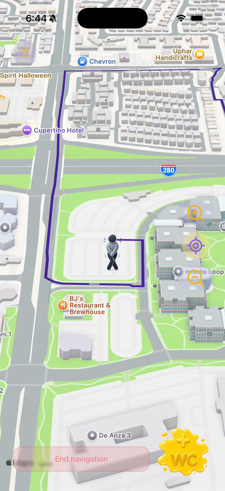
</p>

<p align="center">
  
  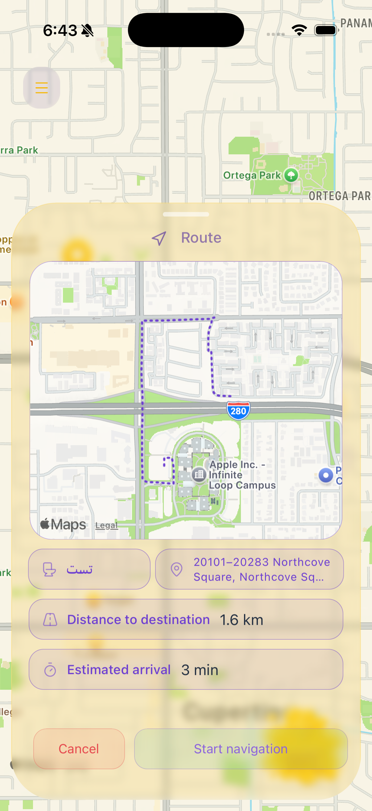
</p>

### Adding and reviewing a toilet

<p align="center">
  
  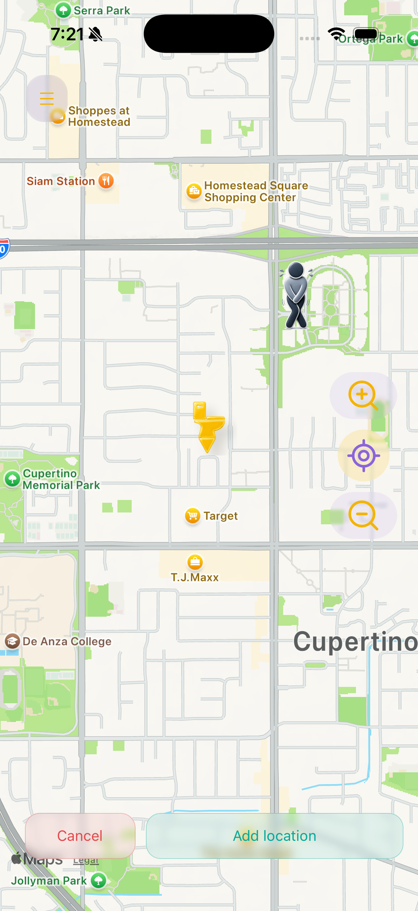
  
</p>

### Account and saved toilets

<p align="center">
  
  
  
</p>

<p align="center">
  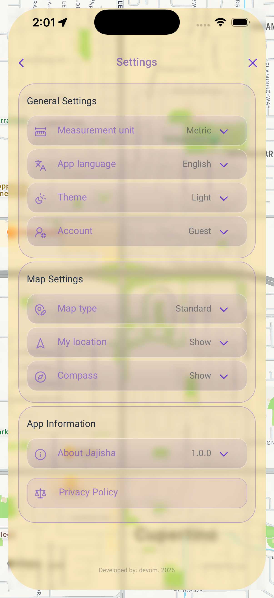
  
  
</p>

---

## Persian / RTL interface

Jajisha also includes a Persian localization with a right-to-left interface.

The layout is adapted for Persian rather than simply translating the text, including navigation, forms, settings, ratings, and application feedback states.

<p align="center">
  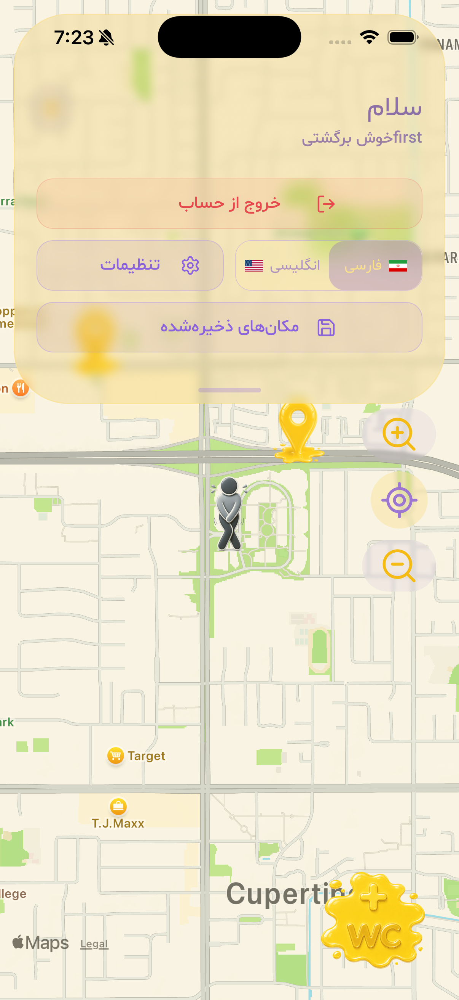
  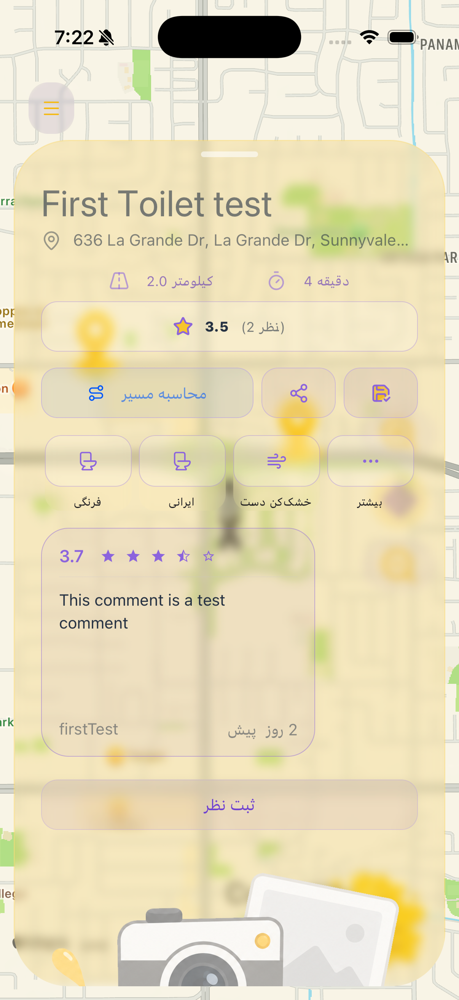
  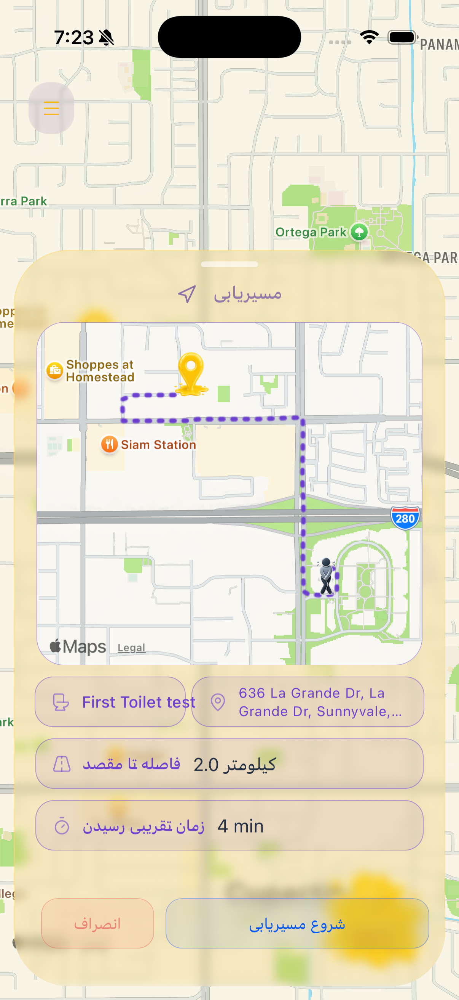
</p>

<p align="center">
  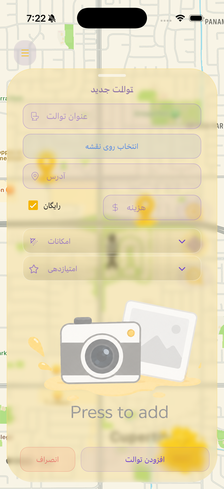
  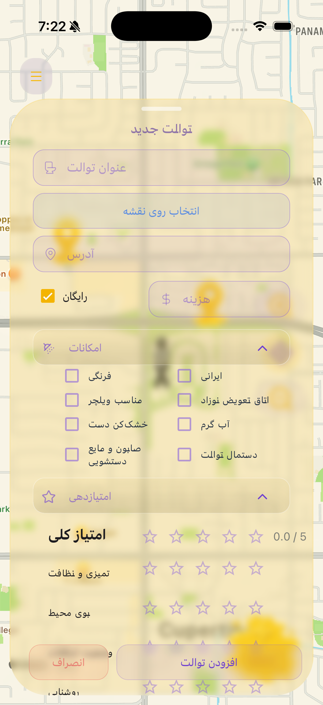
  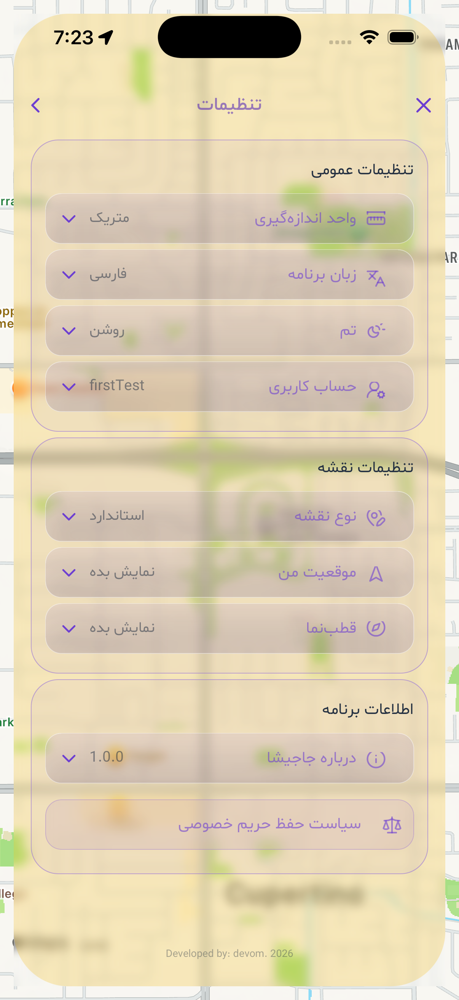
</p>

<p align="center">
  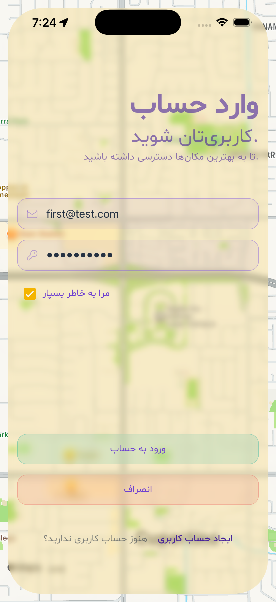
  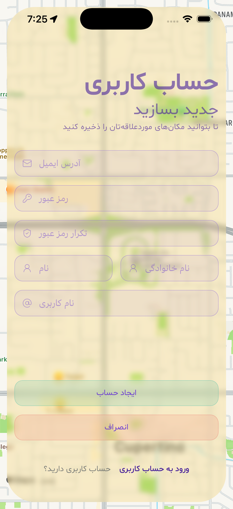
  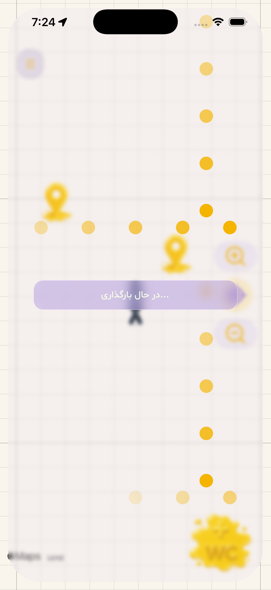
</p>

---

## Ratings and reviews

Toilet ratings are divided into multiple categories instead of relying on a single overall score.

Users can rate aspects such as:

* Cleanliness
* Odor
* Amenities
* Health
* Lighting
* Privacy
* Crowd level

Reviews are tied to authenticated users and a specific toilet. The backend validates review content and rating values before storing them.

---

## Adding a toilet

Adding a toilet is a multi-step flow rather than a single form.

Users can:

1. Select the exact location on the map
2. Enter the toilet information
3. Set whether it is free or paid
4. Add amenities
5. Add supporting information
6. Submit the toilet to the backend

The location is stored as GeoJSON and indexed for geographic queries.

---

## Navigation

Jajisha uses the device's location and heading information to provide an in-app navigation experience.

The navigation flow includes:

* Route preview
* Distance and direction information
* Current location tracking
* Heading updates
* Camera movement following the route
* Navigation-specific map presentation

---

## Authentication and account management

The backend provides authentication using JSON Web Tokens.

Passwords are hashed with `bcryptjs`, while authenticated requests are protected through authorization middleware.

Users can:

* Create an account
* Sign in
* Stay authenticated between sessions
* Access user-specific data
* Manage saved toilets
* Delete their account

Authentication data stored on the device uses Expo SecureStore.

---

## Localization

Jajisha currently supports:

* English
* Persian

The localization system is built with `i18next` and `react-i18next`.

Persian support includes RTL-aware layouts and Persian typography using the Shabnam font family.

---

## Architecture

```text
┌──────────────────────────────┐
│       React Native App       │
│          Expo Router         │
│                              │
│  Map • Navigation • UI       │
│  Auth • Reviews • Favorites  │
│  i18n • Zustand • Settings   │
└──────────────┬───────────────┘
               │
               │ HTTP / REST
               ▼
┌──────────────────────────────┐
│       Express Backend        │
│                              │
│  Routes • Controllers        │
│  Authentication              │
│  Authorization               │
│  Validation • Rate Limiting  │
│  Structured Logging          │
└──────────────┬───────────────┘
               │
               ▼
┌──────────────────────────────┐
│          MongoDB             │
│                              │
│  Users • Toilets             │
│  Reviews • Ratings           │
│  GeoJSON / 2dsphere index    │
└──────────────────────────────┘
```

---

## Tech stack

### Frontend

* React Native
* Expo
* Expo Router
* React Native Paper
* Zustand
* React Native Maps
* Reanimated
* React Native Skia
* Gesture Handler
* Gorhom Bottom Sheet
* Expo Location
* Expo SecureStore
* i18next / react-i18next
* Formik / Yup
* Lucide React Native

### Backend

* Node.js
* Express
* MongoDB
* Mongoose
* JSON Web Token
* bcryptjs
* Helmet
* CORS
* express-rate-limit
* Pino
* Pino HTTP

### Testing

The repository includes frontend tests, backend tests, and a separate security test suite covering areas such as:

* Authentication
* JWT handling
* Authorization
* Validation
* Data exposure
* HTTP security headers
* Injection
* Rate limiting

---

## State management

Application state is separated into focused Zustand stores.

Examples include:

* User state
* Toilet/map data
* Application settings
* Menu state
* Waiting/loading state

This keeps transient UI state separate from application data and user preferences.

---

## Backend

The backend follows a controller / route / model structure.

```text
backend/
├── controllers/
├── logger/
├── middlewares/
├── models/
├── routes/
├── test/
├── app.js
└── server.js
```

The API handles authentication, toilet management, reviews, ratings, favorites, and user management.

Toilets use a MongoDB `2dsphere` index for location-based queries.

---

## Frontend

```text
frontend/
├── app/
├── components/
├── src/
│   ├── hooks/
│   ├── i18n/
│   ├── locales/
│   ├── store/
│   ├── utils/
│   └── validation/
└── tests/
```

The application uses Expo Router for navigation and keeps reusable UI, hooks, state, localization, validation, and utility logic separated from the route screens.

---

## Logging

Both sides of the application have structured logging.

The backend uses Pino and Pino HTTP for server and request logging.

The frontend has its own logger for application-level events and errors.

This makes development and debugging easier without scattering raw `console.log` calls throughout the application.

---

## Running locally

### 1. Clone the repository

```bash
git clone https://github.com/devomid/jajisha.git
cd jajisha
```

### 2. Backend

```bash
cd backend
npm install
npm run dev
```

Create a `.env` file based on `.env.example` and provide the required MongoDB and application configuration.

### 3. Frontend

In another terminal:

```bash
cd frontend
npm install
npm start
```

From there, the application can be launched through the available Expo development targets.

---

## Environment

The backend uses environment variables for configuration rather than committing secrets to the repository.

See:

```text
backend/.env.example
```

for the expected configuration.

---

## Project status

Jajisha is a completed portfolio project built to explore a full mobile product from the user interface through the API and database layer.

The repository includes the application code, tests, security tests, localization resources, documentation assets, and development configuration.

---

## License

This project is licensed under the MIT License.

See [LICENSE](LICENSE).

---

<p align="center">
  Built by <a href="https://github.com/devomid">Omid</a>
</p>
